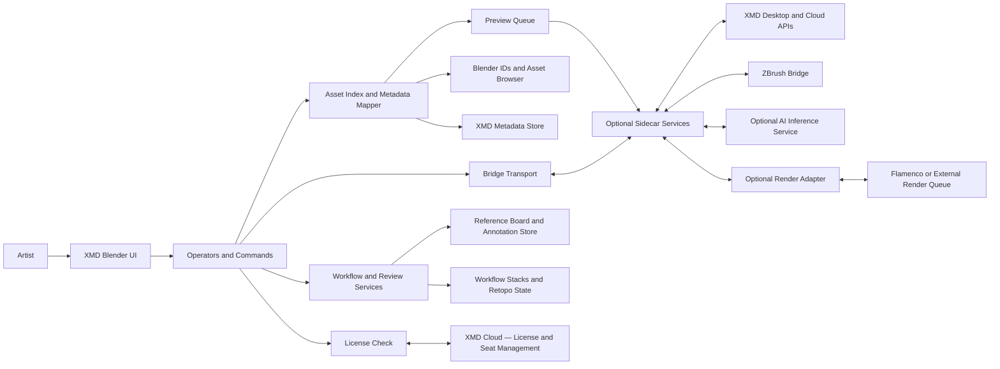

# BlinQ Blender — Product Strategy & Build Plan

## What We Are Building

**BlinQ Blender** is a Blender add-on that serves as the Blender-side component of the XMD ToolBox ecosystem. It bridges ZBrush/XMD Desktop with Blender's native asset, sculpt, and material systems — bringing XMD's asset intelligence, workflow tracking, and review tools into the Blender UI.

**Core thesis:** This is viable and differentiated. No single existing add-on combines a cross-DCC bridge, asset intelligence, workflow-state tracking, and review tools. The market is fragmented; BlinQ can own the intersection.

**Architecture decision:** Do not build a monolithic add-on. Use a **hybrid architecture**:

- **Native Blender add-on** — UI, operators, asset registration, metadata, previews, context actions
- **Optional out-of-process sidecar** — IPC with ZBrush/XMD Desktop, AI inference, large image processing, cloud sync, render-job orchestration
- **XMD Cloud** — the existing licensing and subscription management app; handles license key validation, seat management, and product activation. BlinQ checks activation state against XMD Cloud at startup and caches a signed token locally to allow an offline grace period.

Blender's asset system, brush assets, custom properties, timers, message bus, and preview generation are strong enough for the core vision. The weak points — local AI packaging, live ZBrush viewport mirroring, marketplace plumbing, heavyweight image processing — all belong outside the Blender process.

---

## Summary Decisions

| Area | Decision |
|---|---|
| Blender versions | **5.1.x, 5.0.x, 4.5 LTS** — 4.5 is the compatibility floor; 5.1 is the feature target |
| Operating systems | Windows, macOS, Linux |
| Packaging | Blender extension package + optional private extension repository |
| Architecture | Native add-on + optional sidecar/desktop services |
| MVP focus | **Bridge and asset system first** — not AI, not commerce |
| AI strategy | Out-of-process only; cache results into Blender/XMD metadata |
| License backend | **XMD Cloud** — validates keys, manages seats, activates features; BlinQ caches a signed token for offline grace |
| Marketplace | Build after bridge + library + review loops are stable |

---

## Feature Mapping

### Asset Type Coverage

| XMD asset type | Blender carrier | Parity | Assessment |
|---|---|---|---|
| Brushes | Sculpt/Paint brush assets in Brush Asset Shelf and Asset Browser | Partial | Sculpt and paint brushes map well. ZBrush-specific IMM/VDM brush families do not map one-to-one — split between brush assets and spawnable/object assets |
| Alphas | Brush textures and texture masks; image datablocks | High | Strong fit. Map to images + brush texture presets, with XMD metadata layered on top |
| Textures | Image datablocks, texture paint, material nodes | High | Native fit; good candidate for XMD↔Blender sync in both directions |
| Materials | Blender materials and node groups | High | Native fit; can be marked as assets and previewed automatically |
| Fibers | Hair curves, hair nodes, curve assets, geometry-node presets | Partial | Good functional substitute, but data model differs from ZBrush fibers. Use geometry-node/hair presets, not forced parity |
| Tools | Objects, collections, geometry-node groups, operators, templates | Partial | "Tool" is too broad for native Blender asset types. XMD needs its own subtype schema over Blender IDs |
| Lights | Light datablocks, light rigs, world HDRIs, studio lights | High | Strong fit for light rigs and HDRI workflows |
| Projects | `.blend` files, templates, linked libraries | Low | No direct Asset Browser type for "project." Keep XMD-owned and link out to files/templates |
| Grids | Reference images, "Images as Planes," layout overlays | Partial | Feasible as helper utilities and reference assets, not as a core asset type |
| Array Mesh | Collections, collection instances, geometry-node setups | Medium | Good substitute through collection assets and geometry-node systems |
| Spotlights | World HDRIs, light textures, reference lights | Medium | Functional substitute exists, but naming/behavior differs from ZBrush spotlight workflows |
| Render Presets | Panel presets, output presets, Cycles/Eevee settings presets | High | Native fit; Blender uses presets extensively in UI panels |
| Documents | Text datablocks, notes, external docs, PDF/PNG exports | Low | Weak native fit. Best as XMD review/reference objects with file links, not Blender assets |

### Feature Family Feasibility

| XMD feature family | Feasibility | Recommendation |
|---|---|---|
| Library core (asset manager, category tabs, import/export) | High | Use Blender assets where Blender has an ID type; use XMD JSON registry for cross-type records, licensing, and cloud fields |
| Metadata and search (tags, categories, smart filtering) | High | Lean on native asset metadata; add XMD namespace in custom properties for anything Blender does not store |
| Favorites / history | High | Implement outside the asset system as user-local state keyed by asset UUID |
| Settings and onboarding | High | Straightforward add-on preferences and setup operators |
| Hotkeys and UI | High | Native Blender keymaps, panels, popovers, pie menus; avoid Qt inside Blender UI |
| Bridge foundation (heartbeat, IPC command handling) | High | Use `bpy.app.timers` for polling, not long-running threads; keep transport simple and durable |
| Mesh roundtrip (send/return, multi-SubTool) | High | MVP starts with OBJ + consistent naming/scale; add USD/Alembic later |
| Texture and material send | High | Very good native fit; belongs in MVP |
| Asset Browser sync | High | Core differentiator — ship early |
| Blender → XMD registration ("Add to XMD Library") | High | Also MVP-worthy |
| Retopo workflow tracking | High | Track states in XMD records, not Blender scene names |
| Reference board and annotator | High | Implement in Blender first as docked panel; detached always-on-top window is optional later |
| Randomizer and challenge generator | High | Easy win after MVP |
| Alpha Lab (edit, mix, generate, export alphas) | Medium | Build v1 with non-destructive image stack and previews; validate PSD strategy separately |
| Brush Forge and brush generator | Medium | Reframe around Blender brush assets, stamp presets, and spawnable assets |
| Render farm integration | Medium | Adapter to Flamenco first; do not build a render manager from scratch |
| Workflow engine and analytics | Medium | Worth doing after core asset IDs are stable |
| Studio collaboration (shared libraries, roles, seats) | Medium–High | Keep service-owned; add-on exposes login, sync, and review panes only |
| AI metadata and semantic search | Medium | Use out-of-process inference; cache into Blender/XMD metadata |
| AI kit builder and workflow coach | Medium | Desktop/cloud service; add-on is consumer/UI shell |
| Marketplace and creator tools | Medium | Build as a service first, Blender UI second |
| Live viewport sync | Low–Medium | Keep experimental; likely sidecar/socket feature, never MVP |
| YouTube / training / news embed | Low | Put behind a web panel or external companion |

---

## Technical Architecture

### Key Blender Primitives

| Primitive | Role in BlinQ | Key limitation |
|---|---|---|
| `bpy.app.timers` | Heartbeat checks, IPC polling, queued preview work, library refreshes | Not a substitute for heavy background processing |
| `bpy.msgbus` | Reactive sync when materials, assets, or selected IDs change | Best for RNA/data changes, not external system orchestration |
| Modal operators | Interactive tools, temporary bridge operations, review interactions | Should not become a permanent all-day service loop when timers suffice |
| `bpy.app.handlers` | File/load/save/update lifecycle hooks; startup sync, file-open indexing | Blender warns about thread interactions in some handler contexts |
| Asset metadata | Author, tags, description, catalog | Core to XMD metadata parity; needs XMD extension fields for entitlements/workflow states |
| Asset previews | Automatic and explicit preview generation | Can be scheduled in background threads; bulk work needs careful queuing |
| Custom properties | XMD UUIDs, source IDs, sync hashes, workflow states | Must be versioned and schema-controlled by XMD |
| GPU / offscreen | Previews, compare-mode views, viewport overlays | GPU offscreen resources are tied to graphics contexts; high-end previewing is still delicate in Python |
| Background mode / CLI | Headless tests, conversion, batch rendering, CI | Not every interactive UI path is testable headlessly |
| Keymaps / pie menus | Quick activation, context workflows | Must be conservative to avoid conflicting with user keymaps |

**Critical constraint:** Do not put heavy concurrent work inside Blender threads. Blender's own API docs warn that Python threads can crash Blender in hard-to-diagnose ways, and handler behavior can interact with viewport/render threads. This makes the sidecar architecture the right answer for local AI, large-scale image transforms, web requests, and long-running indexing operations.

> **Add-on should:** schedule, request, cache, and display.  
> **Sidecar should:** compute.

### System Diagram

### Module Layout

| Module | Key classes | Responsibility |
|---|---|---|
| `xmd/prefs.py` | `XMDPreferences`, `FeatureFlags` | Add-on preferences, version caps, paths |
| `xmd/models.py` | `AssetRecord`, `AssetVariant`, `WorkflowStack`, `BridgeJob`, `AnnotationRecord` | Typed data model |
| `xmd/bridge/ipc.py` | `CommandEnvelope`, `ResponseEnvelope`, `HeartbeatMonitor`, `IPCTransport` | File/socket IPC |
| `xmd/bridge/io.py` | `MeshImporter`, `MeshExporter`, `TextureImporter`, `MaterialBuilder` | Roundtrip pipelines |
| `xmd/assets/index.py` | `AssetIndexer`, `CatalogMapper`, `MetadataMapper` | Blender asset integration |
| `xmd/assets/previews.py` | `PreviewManager`, `PreviewQueueItem` | Preview scheduling and generation |
| `xmd/workflow/service.py` | `WorkflowService`, `RetopoTracker`, `RandomKitService`, `ChallengeService` | Workflow state |
| `xmd/review/service.py` | `ReferenceBoardService`, `AnnotationService`, `CompareService` | Review and reference layer |
| `xmd/ui/panels.py` | Panel classes | N-panel surfaces |
| `xmd/ui/menus.py` | `XMDPieMenu`, context menus | Fast action surfaces |
| `xmd/integrations/render.py` | `RenderAdapter`, `FlamencoAdapter` | Render queue integration |
| `xmd/integrations/ai.py` | `AIProvider`, `EmbeddingClient`, `TagSuggestionClient` | Optional local/cloud AI |
| `xmd/integrations/cloud.py` | `CloudLicenseClient`, `SeatValidator`, `ActivationState`, `LicenseCache` | XMD Cloud license/activation; validates key at startup, caches signed token, enforces seat limits and feature flags |

### UI Surfaces

| Surface | What lives there |
|---|---|
| **3D View N-panel tab: XMD** | Bridge status, send/return, active workflow stack, quick library actions, retopo state, review tools |
| **Asset Browser context actions** | "Register in XMD," "Push metadata," "Sync preview," "Send to ZBrush," "Add to Workflow Stack" |
| **Quick pie menu** | Send mesh, send textures, random kit, compare, create challenge, open reference board |

---

## MVP Definition

The MVP ships exactly these things — nothing more:

- Installable add-on with persistent status and diagnostics
- **XMD Cloud license/activation check at startup** (gate the add-on behind a valid or cached token; show a clear activation UI if unlicensed)
- XMD bridge heartbeat
- ZBrush/XMD Desktop → Blender mesh send
- Blender → XMD/ZBrush return send
- Material/texture import
- Native Asset Browser registration and metadata/preview sync
- Blender-side "Add to XMD Library" flow
- Retopo-state tracking
- XMD pie menu and N-panel

**MVP explicitly excludes:**

- Local AI
- Built-in marketplace
- Live viewport sync
- First-party render-farm scheduler

---

## Roadmap

| Milestone | Scope | Dependencies | Exit criteria |
|---|---|---|---|
| **Foundation** | Add-on shell, preferences, bridge transport, heartbeat, logging, status UI, version detection, XMD Cloud activation check and license cache | None | Add-on installs cleanly on 4.5/5.0/5.1, shows reliable bridge status, and correctly enforces or bypasses activation state |
| **MVP** | Send mesh to Blender, send back to ZBrush, import texture/material, Asset Browser registration, metadata/tag/catalog sync, preview sync, context actions | Foundation | Users can roundtrip assets and see XMD-managed assets in Blender reliably |
| **Workflow** | Retopo tracker, random kit, challenge generator, compare mode, light render presets, basic board/annotation | MVP | Artists can move from import to retopo to review without leaving the product |
| **Team tools** | Shared metadata schema, export/import workflow stacks, usage logging, optional render adapter to Flamenco | Workflow | Small teams can share workflows and submit tracked render jobs |
| **Advanced creation** | Alpha Lab v1, Brush Forge v1, stronger preview modes, batch QC tools | Workflow | Asset creation inside the Blender ecosystem becomes credible and repeatable |
| **AI tier** | Semantic search, metadata suggestions, workflow coach, brush/kit suggestions | Sidecar service, library scale | Optional AI features work cross-platform without destabilizing Blender |
| **Commerce and studio platform** | Accounts, entitlements, uploads, storefronts, reviews, analytics, floating seats | Web backend, legal/compliance, billing | Product behaves like a platform, not just an add-on |

---

## Recommended Additions Beyond Current XMD Docs

These capabilities are high-value for Blender users and not covered in the current XMD roadmap:

| Addition | Why it belongs | Implementation note |
|---|---|---|
| Polypaint / color-attribute roundtrip | One of the biggest practical sculpt-transfer wins between ZBrush and Blender | Map ZBrush polypaint to Blender color attributes/vertex paint |
| Face Set / PolyGroup translation | Makes the bridge feel sculpt-native instead of mesh-file-only | Map to Blender Face Sets and color/material grouping strategies |
| Normal / displacement / mask roundtrip | Already proven useful by GoB users | Add explicit texture-set adapters and naming conventions |
| USD / Alembic bridge tier | Better than OBJ for some pipelines and downstream DCC handoff | Keep OBJ for MVP; add USD/Alembic as advanced pipeline modes |
| Batch asset QC tools | Huge value in real libraries: tag fixes, preview refresh, catalog moves, origin checks | Borrow the class of utility BatchGenie demonstrates |
| Light-rig / HDRI browser | Blender is already strong here; XMD's "lights/spotlights/render presets" categories benefit directly | Library + preset manager + turntable scene templates |
| Review snapshots and compare sheets | Strong complement to reference board + annotator | Leverage preview renders, contact-sheet export, before/after compare mode |
| Studio dependency audit | High-value for teams, especially once XMD tracks workflow states | Store usage events in XMD records, not only Blender scene state |

---

## Ecosystem Survey

No single existing add-on matches the full XMD scope. BlinQ wins by combining elements that are currently fragmented across the market.

**Overlap key:** ● strong overlap, ◐ partial overlap, ○ little or none

| Tool | Bridge | Assets | Metadata | Retopo | Ref board | Render ops | AI | Key takeaway |
|---|:---:|:---:|:---:|:---:|:---:|:---:|:---:|---|
| Blender Asset Browser (built-in) | ○ | ● | ● | ○ | ○ | ○ | ○ | The anchor BlinQ should integrate with, not replace |
| GoB (JoseConseco) | ● | ○ | ○ | ○ | ○ | ○ | ○ | Best public reference for ZBrush↔Blender exchange; handles objects, UVs, masks, FaceSets, polypaint, polygroups |
| BlenderKit | ○ | ● | ◐ | ○ | ○ | ○ | ○ | Strong model for cloud-backed search, download, rating, and asset browsing; also uses a client binary |
| Poliigon Blender Addon | ○ | ● | ◐ | ○ | ○ | ○ | ○ | Strong reference for commercial asset browsing, download, preview, and import |
| BatchGenie | ○ | ● | ● | ○ | ○ | ◐ | ○ | Excellent signal for demand around batch previews, tag utilities, author/license metadata, and asset analytics |
| RetopoFlow (CG Cookie) | ○ | ○ | ○ | ● | ○ | ○ | ○ | Best reference for interactive retopo UX and custom tool mode design |
| Quad Remesher (Exoside) | ○ | ○ | ○ | ● | ○ | ○ | ○ | Important benchmark for auto-retopo; integrate if present, do not clone early |
| TexTools | ○ | ○ | ○ | ○ | ○ | ○ | ○ | Good reference for UV/texture tooling, texel density, baking helpers |
| PureRef | ○ | ○ | ○ | ○ | ● | ○ | ○ | Best external reference-board benchmark: notes, canvas, arrange/align, always-on-top |
| Flamenco (Blender Studio) | ○ | ○ | ○ | ○ | ○ | ● | ○ | The obvious render-ops adapter target |

**Strategic gap:** A single Blender-native system that joins cross-DCC bridge, asset intelligence, workflow state, review, and optional studio sync does not exist. That is exactly where BlinQ is differentiated.

---

## Testing Strategy

| Test layer | What to test | Tooling |
|---|---|---|
| Pure-Python unit tests | Schema validation, metadata mapping, path rules, command envelopes, workflow logic | Standard Python test runner |
| Headless Blender integration | Register/unregister, asset marking, metadata writes, preview generation, import/export roundtrips | Blender launched in background mode |
| Cross-version matrix | 4.5 LTS, 5.0, 5.1 on Windows/macOS/Linux | CI matrix builds |
| Golden-file tests | OBJ/USD/Alembic roundtrip, image transforms, preview outputs | Artifact comparisons |
| Manual UX passes | N-panel flows, Asset Browser right-click flows, pie-menu discoverability, annotation interactions | Curated test scripts |
| Performance tests | Library indexing, preview generation, large image ops | Timed benchmarks with seeded sample libraries |

---

## Packaging and Licensing Strategy

| Option | Pros | Cons | Best use |
|---|---|---|---|
| Official Blender Extensions platform | Native install/update flow, trust, discoverability | Must be GPL-3.0-or-later; not compatible with proprietary code | Free/open-core add-on |
| Private static extension repository | Uses Blender's extension update system; control release pacing | Disciplined packaging/versioning required | Paid or open-source add-on distribution |
| Direct ZIP add-on | Simple and familiar | Weaker update story | Emergency channel or legacy fallback |
| Separate desktop companion / sidecar | Keeps heavy services outside Blender | More packaging work | AI, sync, detached review window, bridge daemon |
| Hosted SaaS | Enables entitlements, sync, analytics, stores, studio seats | Backend/legal/support burden | Team features, marketplace, AI APIs |

**XMD Cloud is the entitlement backend for BlinQ:**

- The add-on calls XMD Cloud at startup to validate the license key and retrieve a signed activation token.
- The token is cached locally (with a TTL) so the add-on can function offline during the grace period without contacting the server on every launch.
- Seat limits and per-feature flags are encoded in the token; the add-on reads them to show/hide paid features.
- Studio seat management (floating seats, team libraries) is handled entirely by XMD Cloud — the add-on only presents the UI and polls state.
- If the XMD Cloud service is unreachable and the cached token is expired, the add-on should degrade gracefully (warn, disable gated features) rather than hard-blocking all functionality.

**Recommended monetization model:**

- **Open-source GPL add-on code** — sold as a paid product if desired; release packaging and support are the commercial value
- **XMD Cloud subscriptions** — individual and studio seats, validated through XMD Cloud; unlocks paid features and cloud sync
- **Paid content** — asset packs, workflow kits, tutorials, light/scene packs
- **Studio seats** — floating seat management via XMD Cloud; fits the roadmap's shared-library and team direction

---

## External Library Decisions

| Library | Needed for | Recommendation | License |
|---|---|---|---|
| `bpy` only | Core MVP | Use for MVP wherever possible | GPL-compatible |
| NumPy | Image math, preview transforms, analytics | Optional dependency; ideally in sidecar | BSD |
| Pillow | Lightweight image processing | Good for simple image ops | MIT-CMU |
| OpenImageIO | Advanced image I/O and robust batch processing | Strong optional dependency for Alpha Lab; prefer over extending Blender's UI runtime | Apache-2.0 |
| ONNX Runtime | Local embeddings / lightweight inference | Best AI runtime candidate for local inference | MIT (requires Python ≥ 3.11) |
| sentence-transformers | Semantic search and kit retrieval | Sidecar only — heavy dependency stack | Apache-2.0 (requires Python ≥ 3.10) |
| PySide6 / Qt for Python | Detached desktop UI or companion app | External companion only; never inside native Blender UI | LGPL/commercial — requires compliance decisions |

**Asset licensing note:** Third-party asset APIs (e.g., Poliigon) explicitly restrict redistribution and AI use of their assets. If BlinQ ever ingests third-party assets, it must preserve source licensing and prevent accidental inclusion in AI or marketplace pipelines.

---

## Risk Register

| Risk | Impact | Likelihood | Mitigation |
|---|---|---|---|
| Blender API and bundled Python drift across 4.5/5.0/5.1 | Breaks dependencies or registration paths | Medium | Keep MVP dependency-light; move AI and heavy image processing to sidecar |
| Over-ambitious one-to-one ZBrush feature parity | Bloated UX, weak Blender fit | High | Translate concepts; use Blender-native carriers first |
| In-add-on AI packaging becomes brittle | Installer pain, support burden, crashes | High | Make AI optional and out-of-process |
| Asset metadata divergence between XMD and Blender | Sync bugs and user mistrust | Medium | Single UUID authority, schema versioning, hash-based sync |
| Roundtrip identity loss on mesh send/return | Broken replace/merge workflows | Medium | Persistent UUID tags and deterministic naming rules |
| Preview/indexing performance on large libraries | UI lag | Medium | Queue previews, incremental indexing, background sidecar processing |
| XMD Cloud unavailable at activation time | User cannot activate; perceived as broken add-on | Medium | Cache signed token with TTL; allow offline grace period; show clear retry UI rather than hard-blocking |
| XMD Cloud API changes break activation flow | Add-on stops activating after a XMD Cloud update | Low–Medium | Version the activation API; test against staging before releasing add-on updates |
| Licensing confusion around GPL add-on code vs hosted services | Business friction | Medium | Separate code license, service terms, and asset-content terms cleanly |
| Marketplace scope explosion | Delays core product | High | Marketplace only after bridge + library + review loops are stable |
| Live viewport sync proves unreliable | Damages perceived polish | Medium | Keep experimental and off by default |
| Render-farm support becomes a product of its own | Opportunity cost | Medium | Adapter to Flamenco first; never reinvent queueing early |

**Highest-risk features:** live viewport sync, in-add-on local AI, embedded marketplace, full ZBrush brush-semantic parity.  
**Lowest-risk, highest-payoff features:** bridge status + send/return, Asset Browser sync, metadata and preview utilities, retopo-state tracking, reference/review surfaces.

---

## Open Questions

- The XMD roadmap mixes "already-implemented," "in-progress," and "future" statements inconsistently. Some release-state judgments should be verified against the actual shipping codebase before scoping work.
- A production-grade layered-PSD export stack suitable for Alpha Lab has not been fully evaluated. PNG/TIFF/EXR-class pipelines are far clearer than PSD.
- Live ZBrush camera/turntable sync depends on capabilities on the XMD/ZBrush side that are outside Blender's own API — these need to be confirmed with the XMD Desktop team.
- If official-store distribution through Blender Extensions is desired, the add-on code must be GPL. If proprietary add-on code is required, it cannot go on the official platform. Hosted services remain the better monetization lever in either case.
- XMD Cloud activation API contract (token format, TTL, seat fields, feature flags) needs to be defined and versioned before the Foundation milestone ships, since the add-on's license check is wired to it from day one.